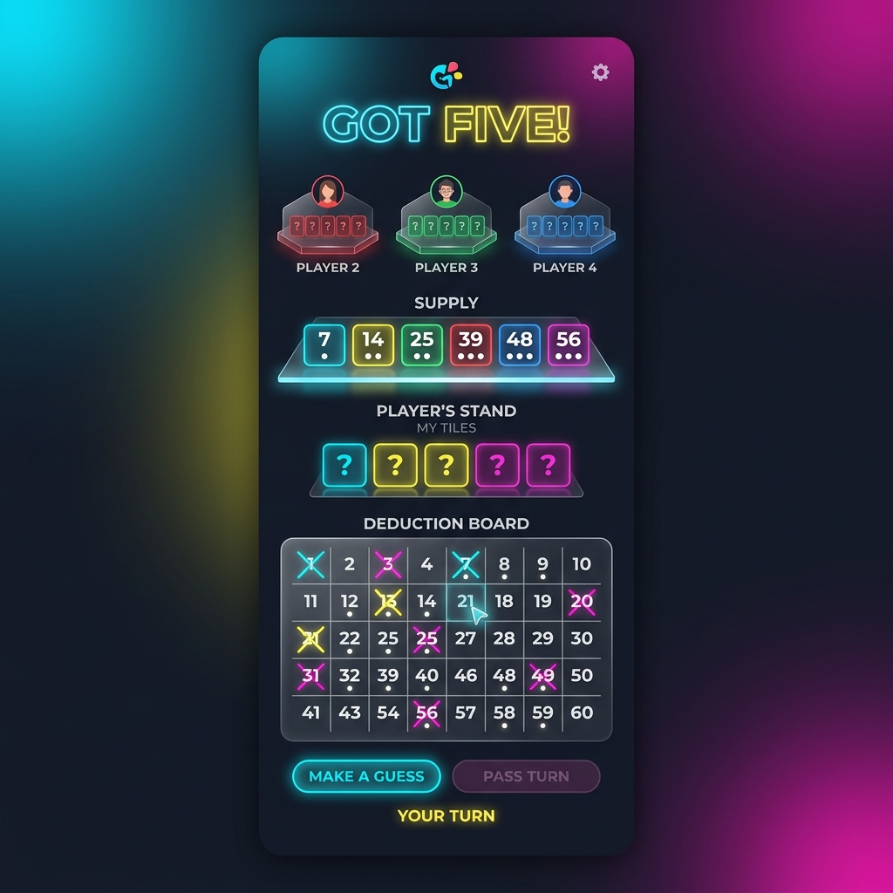
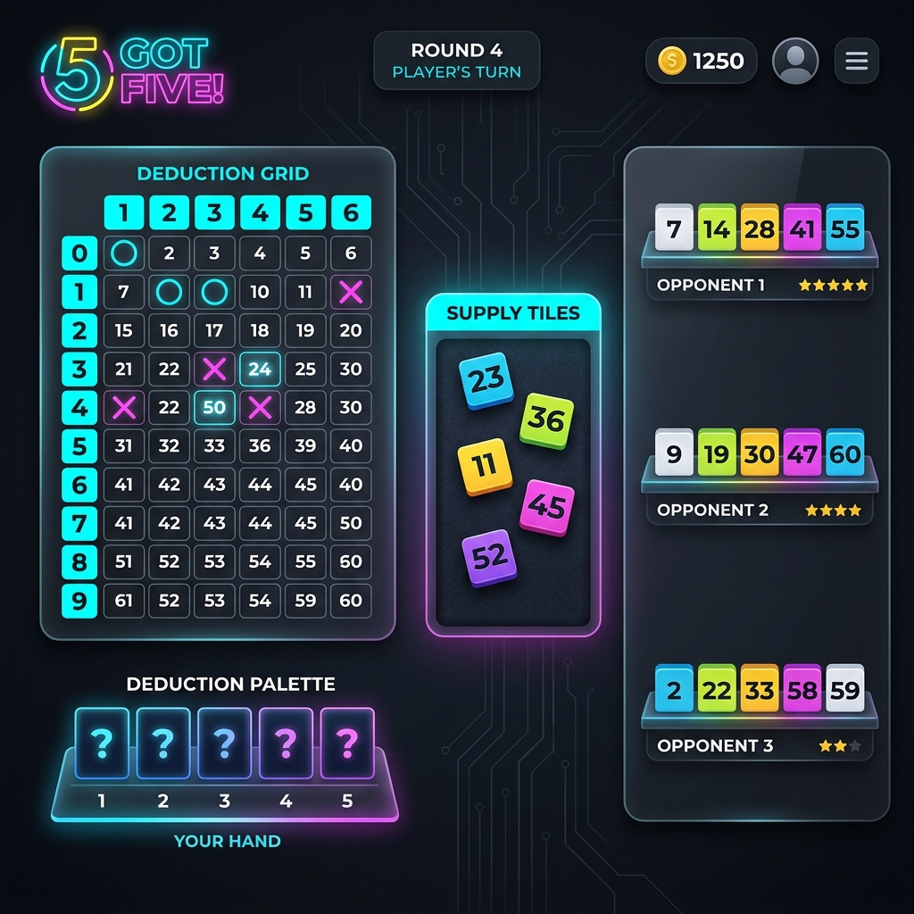

# Got Five! UI Overhaul Design Document

## Objective
Transform the UI of the *Got Five!* web game to be fully playable on mobile phones in both portrait and landscape orientations. The aesthetic should be modern, utilizing glassmorphism, deep matte dark backgrounds, and vibrant neon highlights.

## Design Inspiration
The new aesthetic is inspired by premium spatial UI, replacing the current "wood and cream" tabletop styling with a "neon in the void" aesthetic. This fits better with mobile interfaces, using glowing materials, smooth gradients, and clear, distinct interactive states.

### Key Visual Changes
- **Backgrounds**: Deep blacks and dark blues (`#0B0C10`, `#1F2833`) with subtle radial gradients.
- **Glassmorphism**: Translucent panels with background blurs for menus, player stands, and deduction boards.
- **Accents**: Neon Cyan, Banana Yellow, and Hot Magenta used for highlights, borders, and interactive feedback.
- **Typography**: Modern, rounded sans-serif (e.g., *Inter* or *Outfit*).

## Layout Strategy

### Portrait Orientation (Mobile)
In portrait mode, screen space is vertically constrained. The layout will flow top-to-bottom:
1. **Header**: Small game title and turn indicator.
2. **Opponents' Stands**: Scaled-down views of opponent tiles, arrayed horizontally or stacked compactly.
3. **Public Supply**: Central, distinct tiles.
4. **Player's Stand**: The 5 hidden tiles the player is guessing, clearly delineated.
5. **Deduction Board**: Instead of a full-screen toggle or a compressed grid, the 1-60 grid is rendered as a clean, interactive overlay that can slide up or be embedded in the bottom half of the screen.

### Landscape Orientation (Tablet / Mobile Landscape)
In landscape mode, horizontal space is maximized.
1. **Left Side / Center Left**: The main game area, featuring the opponents' stands on the top or right, and the public pool centered.
2. **Right Side**: The Deduction Board (1-60 grid) can remain constantly visible as a side panel without needing to toggle.
3. **Bottom**: The player's own 5 tiles.

## Mockups

### Portrait Mode Mockup
This mockup illustrates the vertical layout and the deep, glassmorphic aesthetic applied to the various components.

### Landscape Mode Mockup
This mockup illustrates a horizontally optimized layout, keeping the deduction board easily accessible while managing the player and opponent tiles efficiently.

## Implementation Steps (Proposed)
1. **Theme Overhaul**: Replace existing CSS root variables in `App.css` and `index.css` with the new color palette.
2. **Layout Restructuring**: Leverage CSS Grid and Flexbox with media queries `(orientation: portrait)` and `(orientation: landscape)` to seamlessly transition layouts.
3. **Component Polish**:
   - Round the edges of tiles.
   - Introduce soft glow effects for active turns and "Sort/Compare" actions.
   - Make the `DeductionBoard.svelte` canvas rendering more neon-styled.
4. **Testing**: Run Playwright E2E tests to verify layout adjustments don't obscure clickable elements.
