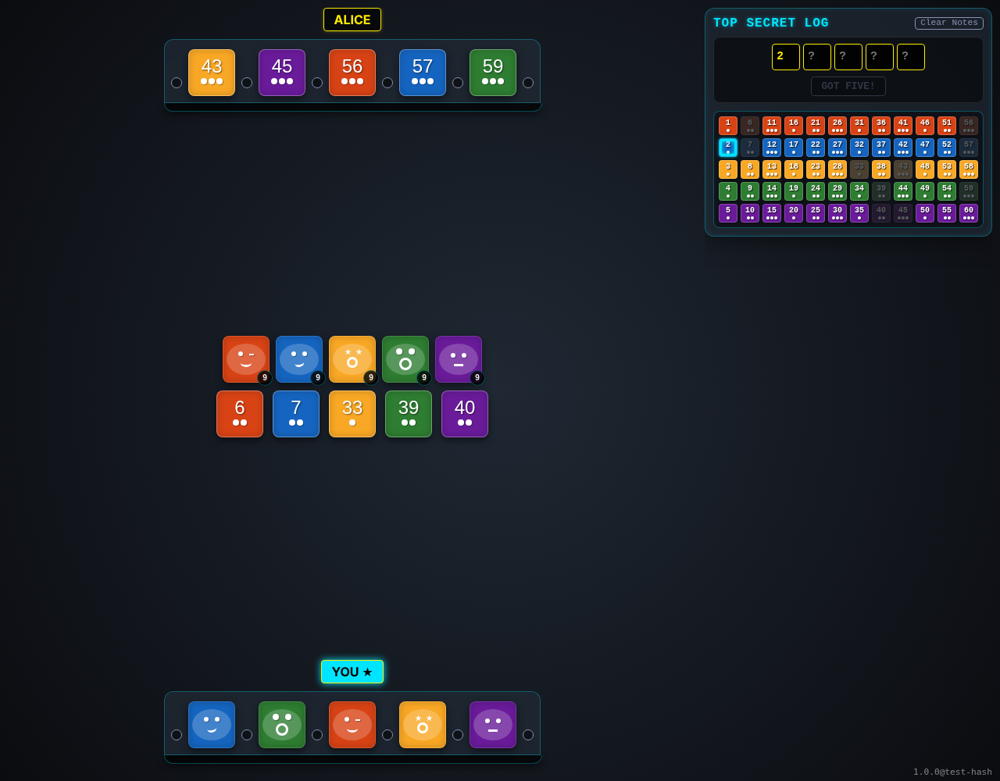
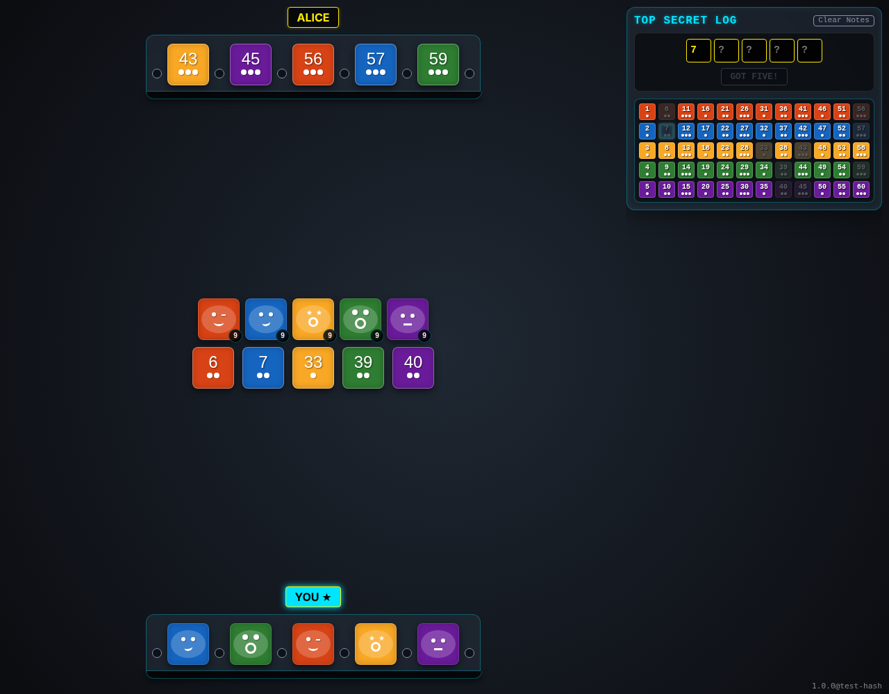
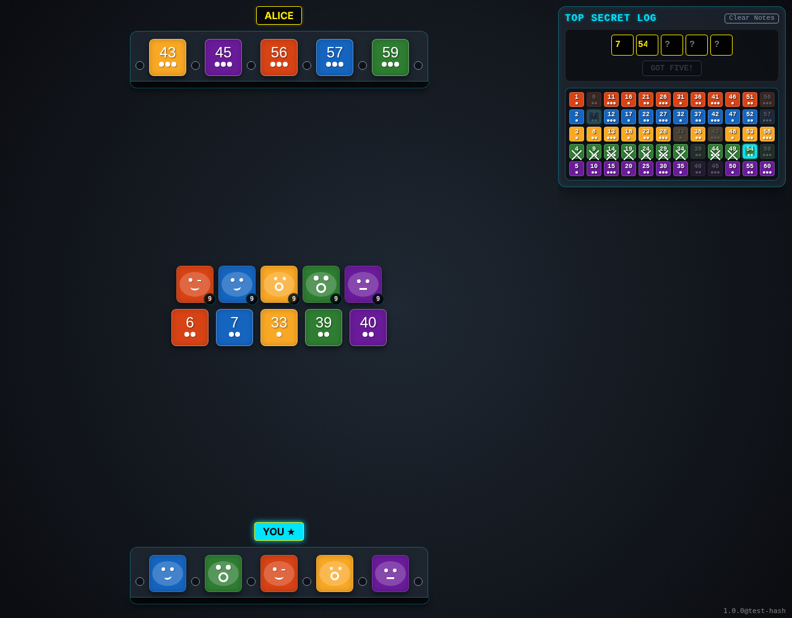
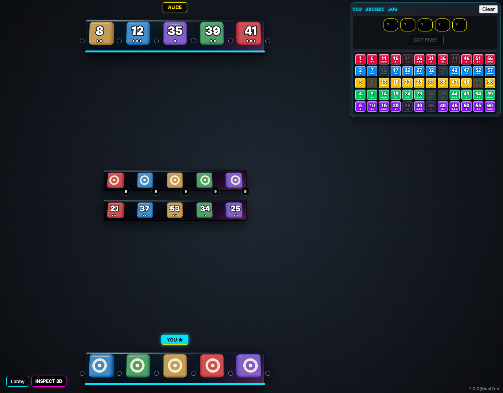

# Refinements

Verify Deduction Board auto-fill, sync, and Play Again button behavior.

## Marking a tile OK fills the corresponding guess input based on rack position

**Verifications:**
- [x] Guess input 0 is filled with "2"

---

## Marking a second tile OK in the same color row clears the first one

**Verifications:**
- [x] Tile 7 is OK
- [x] Tile 2 is now clear (neither OK nor X)
- [x] Guess input 0 is updated to "7"

---

## Identify visible tiles in the second slot color row

**Verifications:**

---

## If only one tile is possible, it is automatically marked OK

**Verifications:**
- [x] At least one tile in the second slot color row is OK
- [x] Guess input 1 is filled

---

## Clicking Play Again as a host immediately starts a new game

**Verifications:**
- [x] Game status is PLAYING (status banner is gone)
- [x] Deduction board is reset
- [x] Players have new hands (5 tiles)

---

