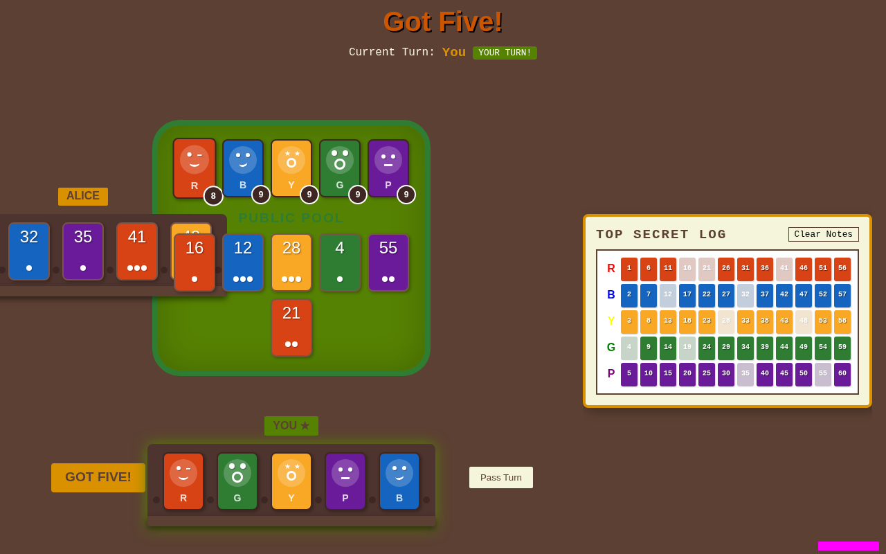
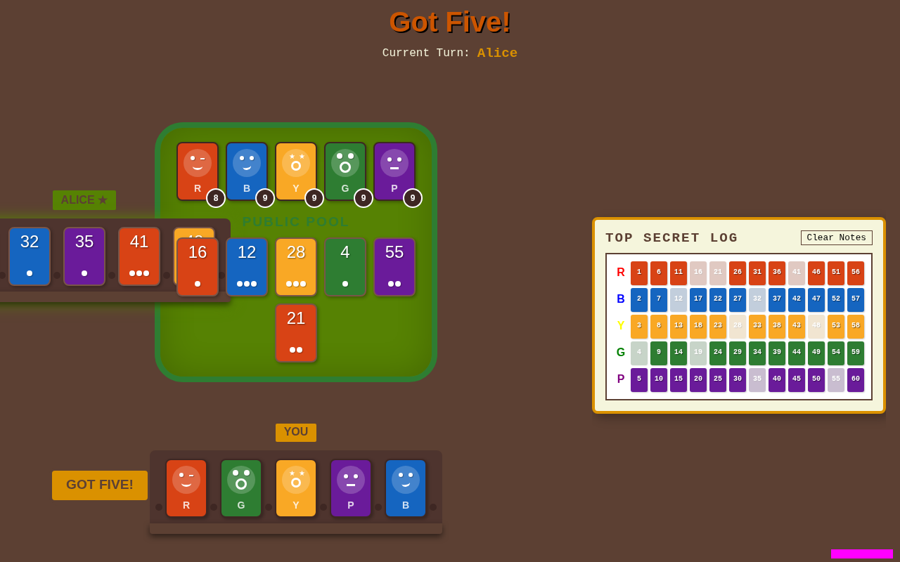
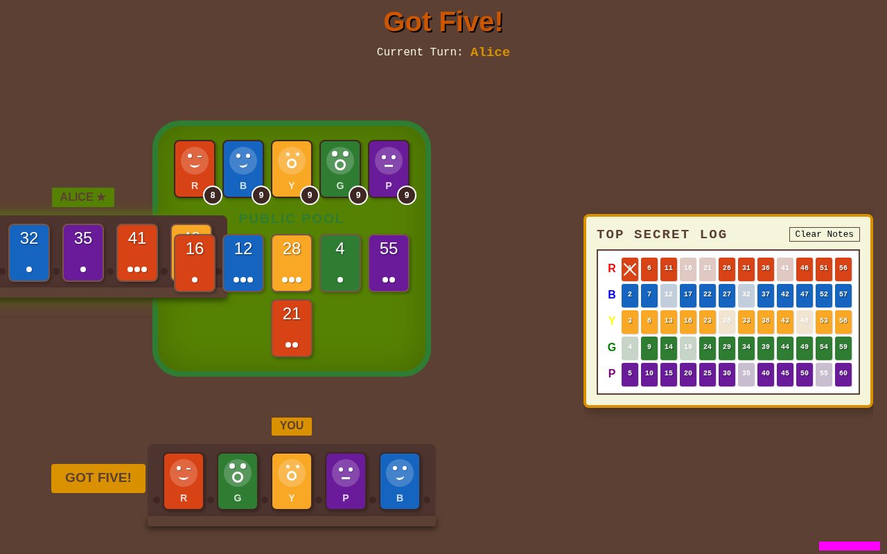

# Gameplay

As a user, I want to play through a game with deterministic results.

## Game initializes with correct number of tiles

**Verifications:**
- [x] Player "You" has 5 tiles
- [x] Public pool has 5 initial tiles
- [x] Each of the 5 colored decks has 9 tiles remaining

---

## Revealing a tile updates the public pool and deck count

**Verifications:**
- [x] Public pool now has 6 tiles
- [x] Red deck has 8 tiles remaining

---

## Asking for a clue records it on the stand

**Verifications:**
- [x] Alice stand has one active sorting notch
- [x] Public tile is deselected after action

---

## Deduction board cells can be toggled and show automated marking

**Verifications:**
- [x] First cell shows a strike (X)
- [x] Public tiles are dimmed on the deduction board

---

## Guessing flow shows the modal and processes the guess

**Verifications:**
- [x] Guess modal is closed after submission

---

