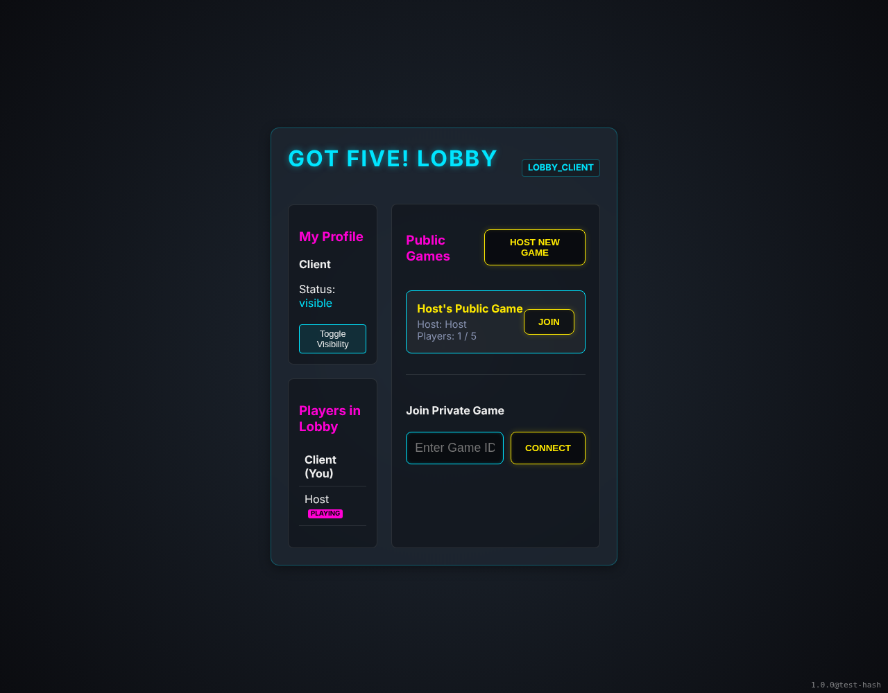
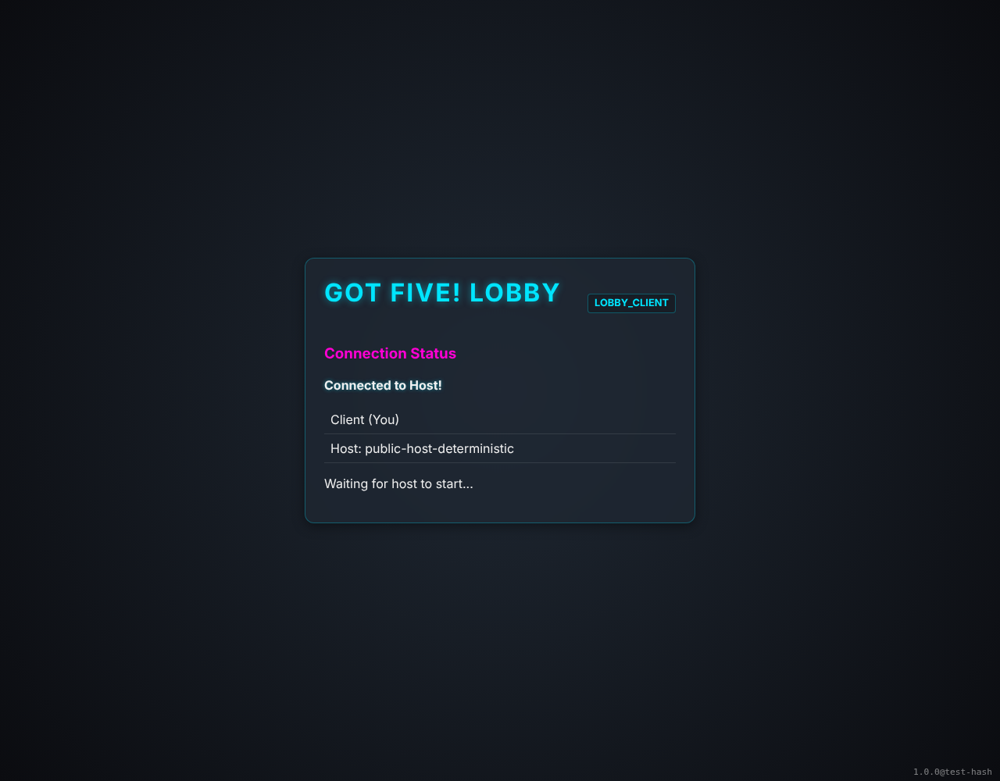

# Public Game Lobby

Testing public game discovery and joining.

## Public game is visible in the lobby

**Verifications:**
- [x] Game card is visible

---

## Client successfully connected to the host

**Verifications:**
- [x] Connection message visible

---

