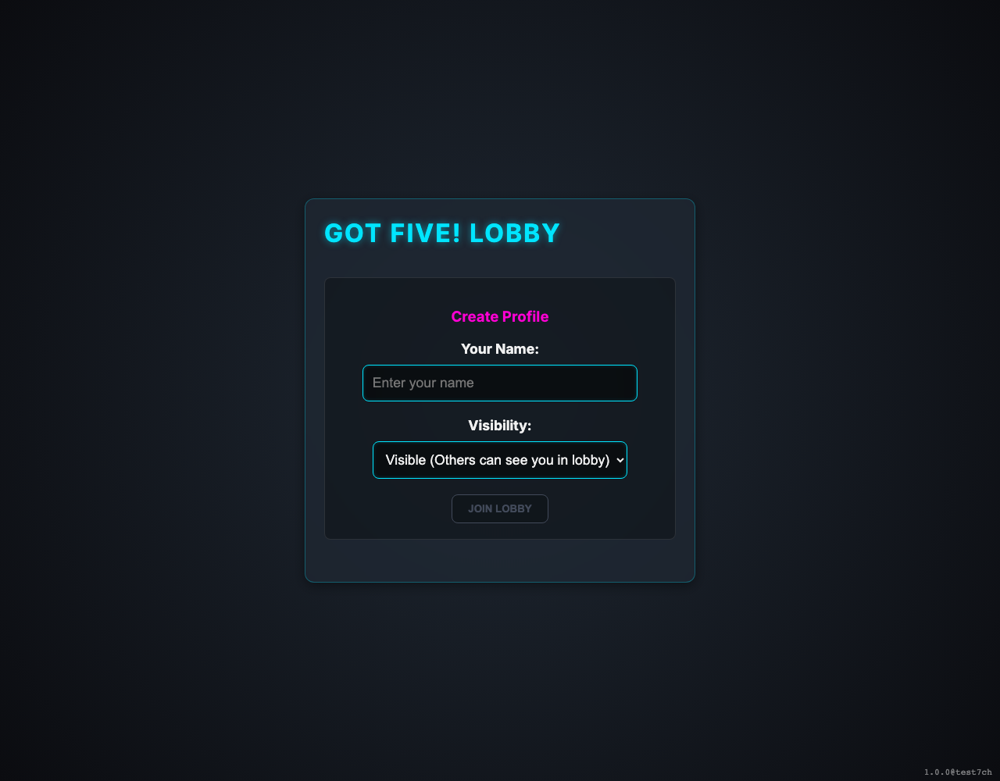

# Multiplayer Lobby

Testing the initial lobby state.

## Lobby is visible

**Verifications:**
- [x] Lobby header is visible
- [x] Name input is visible
- [x] Host button is visible
- [x] Join button is visible

---

