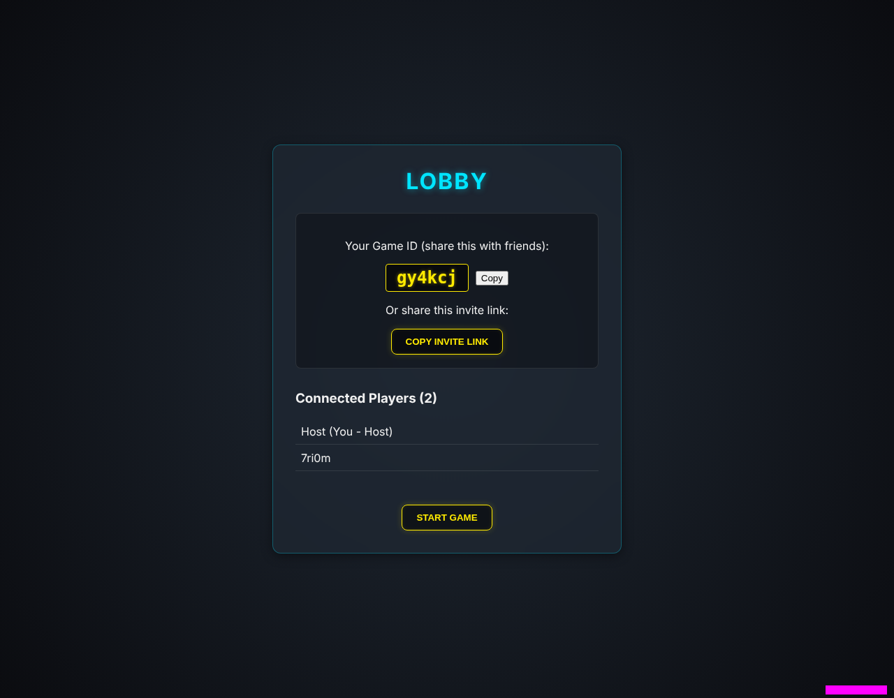
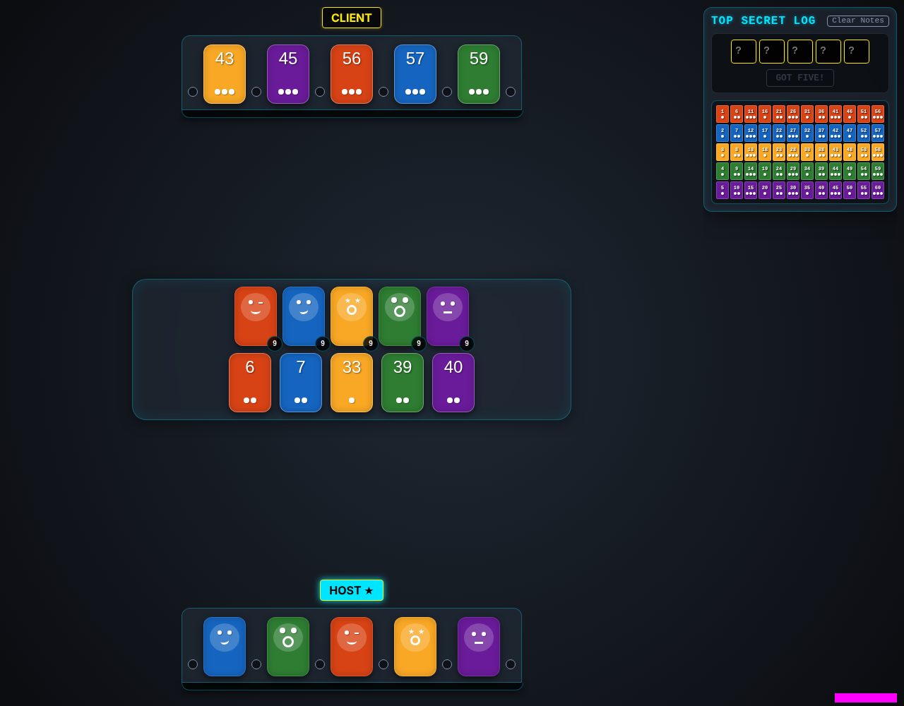
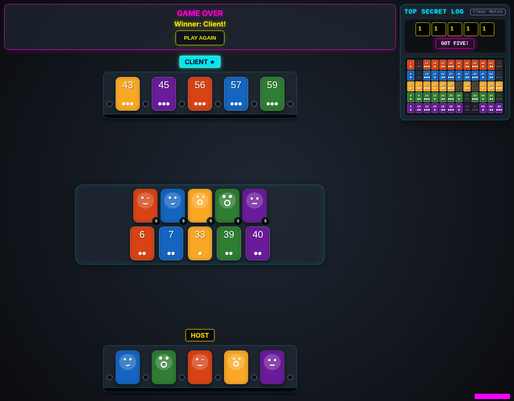

# Multiplayer Turn-Taking

Testing turn rotation and elimination in multiplayer.

## Players are connected in lobby

**Verifications:**
- [x] Host sees 2 players

---

## Game started and current turn is indicated

**Verifications:**
- [x] Current turn indicator is visible

---

## Game over state shown for both players

**Verifications:**
- [x] Winner is announced

---

