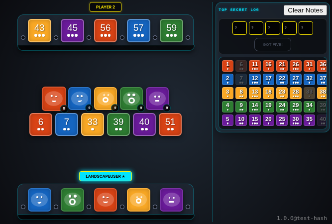
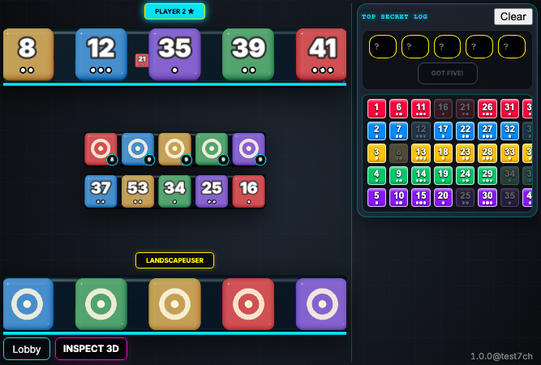
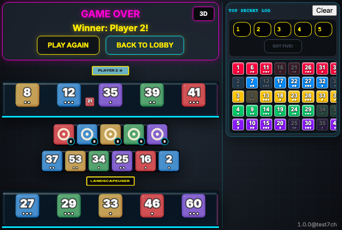

# Mobile Landscape

Verify layout on mobile landscape.

## Main play area and deduction board are both visible horizontally

**Verifications:**
- [x] Main play area is visible
- [x] Deduction board is visible horizontally

---

## Reveal a tile in landscape mode

**Verifications:**
- [x] Public pool has 6 tiles

---

## Ask for a clue in landscape mode

**Verifications:**
- [x] Player 2 stand has an active notch

---

## Submit a guess in landscape mode

**Verifications:**
- [x] Status banner is visible

---

