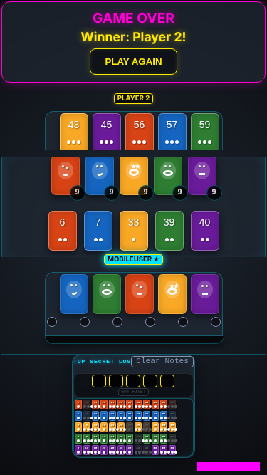
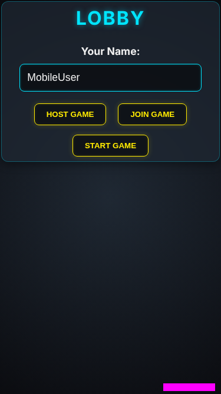

# Mobile Portrait

Verify layout and gameplay on mobile portrait.

## Main play area and deduction board are visible together

**Verifications:**
- [x] Main play area is visible
- [x] Deduction area is visible without toggling
- [x] Opponents are in viewport
- [x] Table is in viewport
- [x] Player stand is in viewport
- [x] Deduction area is in viewport

---

## Game over status shows on mobile

**Verifications:**
- [x] Status banner is visible
- [x] Winner message is correct

---

## Game resets to lobby state without page reload

**Verifications:**
- [x] Lobby is visible again
- [x] Game status is LOBBY in store
- [x] Connected players are preserved

---

