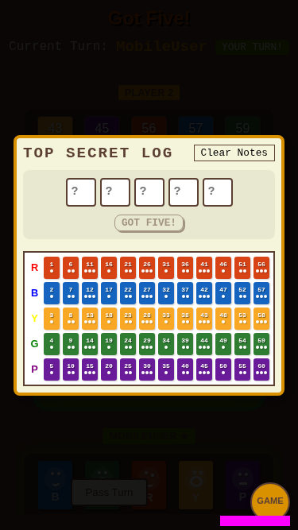
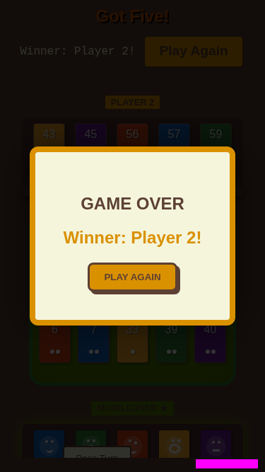
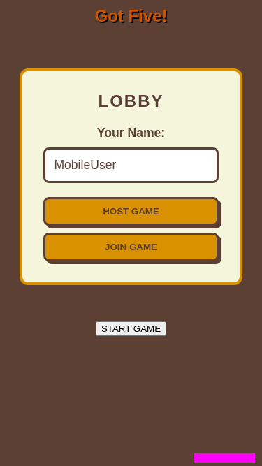

# Mobile Portrait

Verify layout and gameplay on mobile portrait.

## Main play area is visible, board is hidden by default

**Verifications:**
- [x] Main play area is visible
- [x] Sidebar is hidden by default
- [x] Toggle button exists

---

## Deduction board opens when toggled

**Verifications:**
- [x] Sidebar is now visible
- [x] Deduction board title is visible

---

## Game over modal shows on mobile

**Verifications:**
- [x] Overlay is visible
- [x] Winner message is correct

---

## Game resets to lobby state without page reload

**Verifications:**
- [x] Lobby is visible again
- [x] Game status is LOBBY in store
- [x] Connected players are preserved

---

