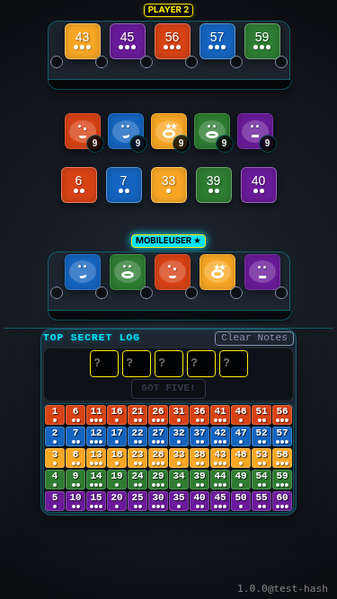
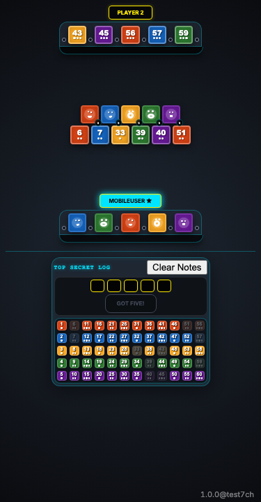
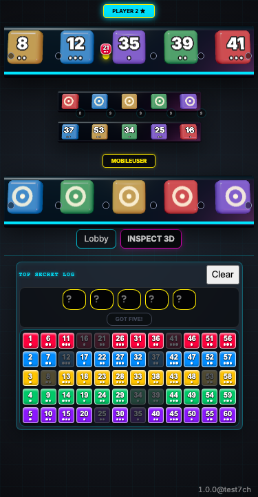
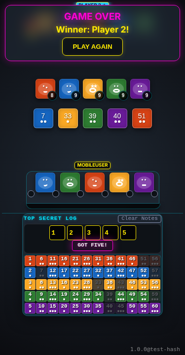
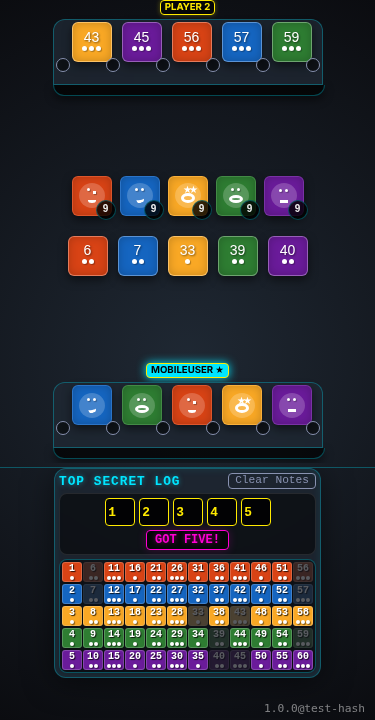

# Mobile Portrait

Verify layout and gameplay on mobile portrait.

## Main play area and deduction board are visible together

**Verifications:**
- [x] Main play area is visible
- [x] Deduction area is visible without toggling

---

## Reveal a tile in portrait mode

**Verifications:**
- [x] Public pool has 6 tiles

---

## Ask for a clue in portrait mode

**Verifications:**
- [x] Player 2 stand has an active notch

---

## Submit a guess in portrait mode

**Verifications:**
- [x] Status banner is visible

---

## Game over status shows on mobile

**Verifications:**
- [x] Status banner is visible
- [x] Winner message is correct

---

## Game resets to lobby state without page reload

**Verifications:**
- [x] Lobby is visible again

---

