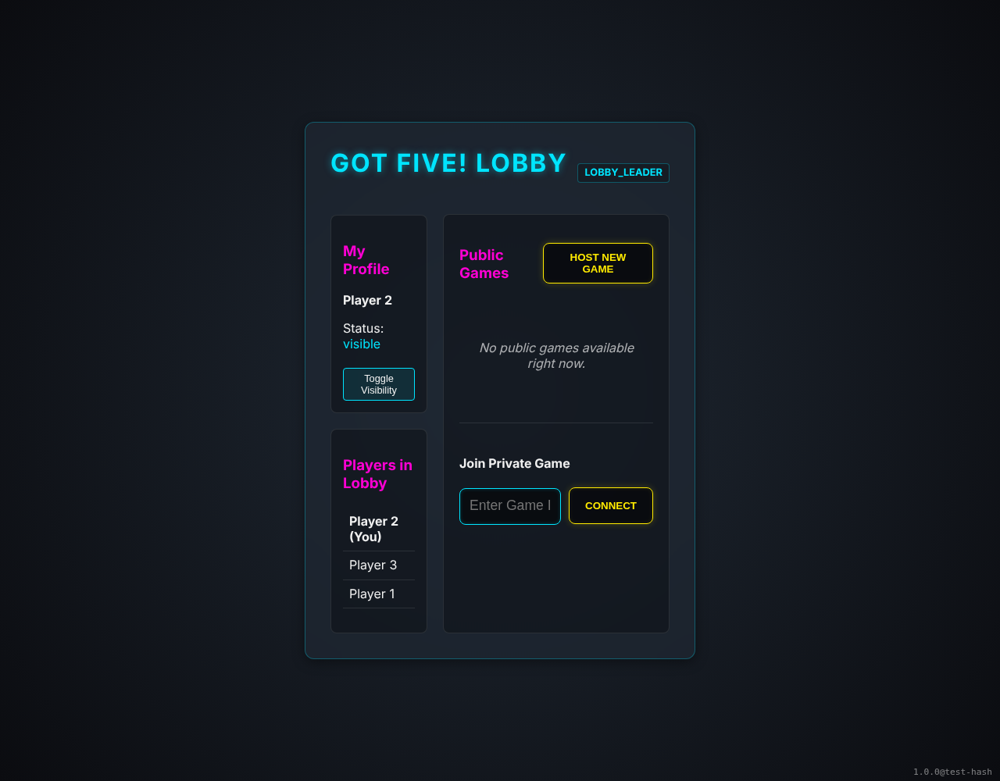

# Lobby Leader Handoff

Testing that leadership is handed off correctly based on seniority.

## Three players in lobby, P1 is leader

**Verifications:**
- [x] P2 is client
- [x] P1 is visible in list

---

## P2 becomes leader after P1 leaves

**Verifications:**
- [x] P2 is now leader
- [x] P3 is still visible

---

