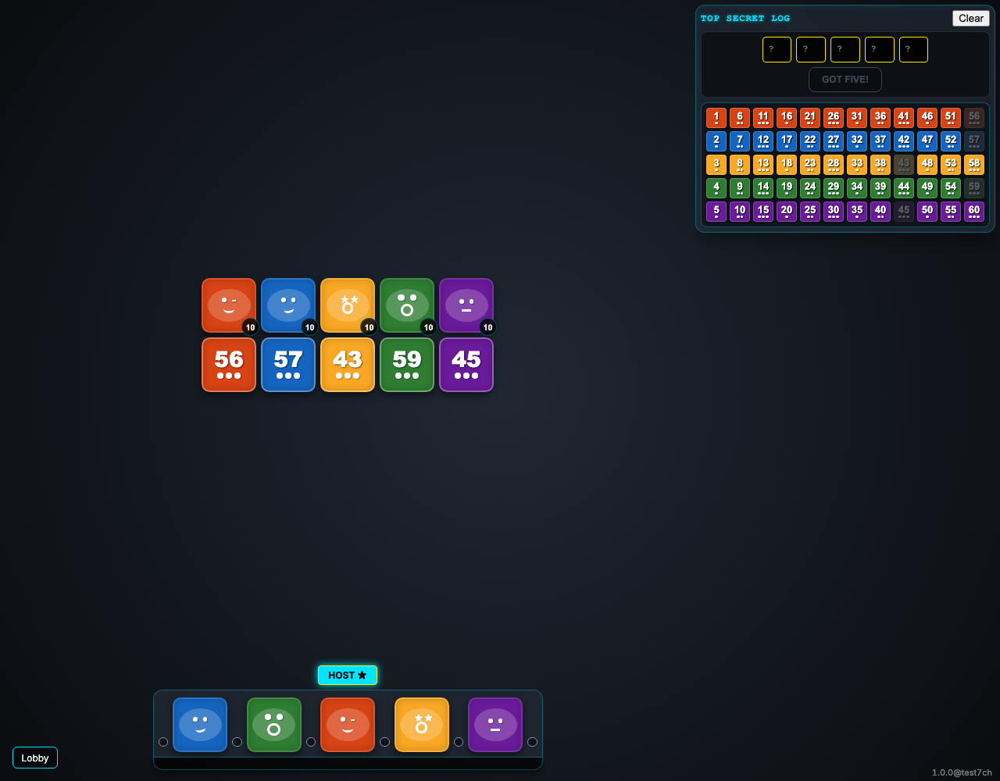

# Room Roster Isolation

Testing that a new room starts with only players who joined that room.

## A new room starts without a player from the previous game

**Verifications:**
- [x] Anna is absent from the new game
- [x] Only the host is in the new game roster

---
