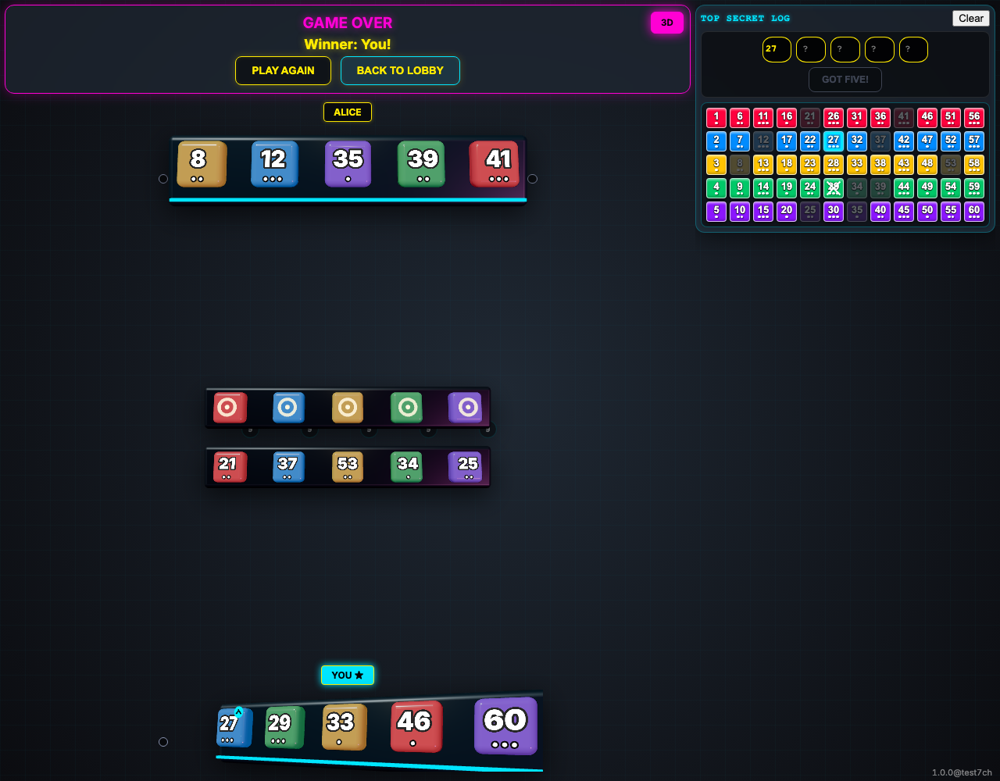

# Game Over Hand Reveal

Testing that game over reveals every tile and celebrates deductions the viewer got right.

## Game over reveals every hand and marks the correctly deduced tile

**Verifications:**
- [x] All ten hand tiles are face up
- [x] The correctly deduced tile has a checkmark
- [x] An incorrect deduction is not marked as correct

---

## Inspection mode orbits a rack while preserving the complete game view

**Verifications:**
- [x] All four rack and table scenes expose orbit controls
- [x] Inspection mode remains visibly active until the player exits it

---
